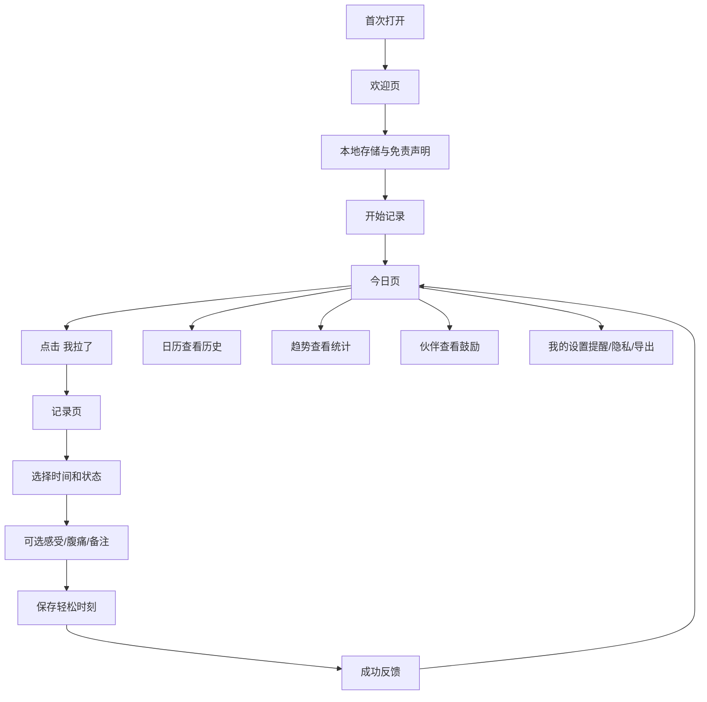

# Lafo MVP 本地版产品与实现方案

日期：2026-05-10  
产品名：Lafo  
一句话介绍：Lafo，让每一次轻松都有记录。  
版本定位：iOS 本地优先、轻量、可爱、不医疗化的排便记录 App。

## 1. 完整 PRD

### 背景

排便记录是高频但私密的生活健康记录。用户可能想了解自己的肠道节奏，但传统健康工具常显得严肃、复杂或让人焦虑。Lafo 用可爱角色、轻量记录、日历和简单趋势，把这件事变成温柔、好坚持的小习惯。

### 目标

- 用户能在 3 秒内完成一次基础记录。
- 用户能看到今日次数、历史日历和简单周/月趋势。
- 所有记录默认保存在本地，不要求登录，不上传服务器。
- 语气可爱、轻松、私密，不制造焦虑，不做诊断。

### 目标用户

- 想记录排便规律的人。
- 肠胃敏感或偶尔不顺，但不想使用严肃医疗 App 的人。
- 喜欢可爱打卡、养成、小宠物反馈的年轻用户。
- 想从生活节奏、饮水、饮食、作息角度观察自己的人。

### 用户问题

- 记录过程麻烦，容易忘。
- 排便话题尴尬，传统表述不够友好。
- 用户想了解规律，但不希望被诊断、打分或吓到。
- 私密数据让用户担心上传、账号和广告追踪。

### MVP 范围

Must have:

- 首次欢迎与隐私/免责声明确认。
- 底部 Tab：今日、日历、趋势、伙伴、我的。
- 首页显示今日问候、大按钮「我拉了 💩」、今日次数、今日状态、连续记录天数、宠物反馈。
- 快速记录：时间、便便状态必填；感受、腹痛程度、备注选填。
- 日历按月展示每日次数，点击查看当天记录，支持编辑和删除。
- 统计展示今日、本周、本月、平均次数、连续记录、常见状态、常见时间段。
- 伙伴页展示 Lafo 小宠物、等级、连续记录、解锁状态和鼓励文案。
- 设置页提供提醒、数据导出、隐私政策、用户协议、医疗免责声明、清空本地数据。
- 本地持久化，不登录，不云同步。

Non-goals:

- 登录注册、账号体系、云同步、社区、AI 问诊、医生咨询、复杂健康报告、订阅、广告、第三方追踪。

### 用户故事

- 作为用户，我希望打开 App 后一眼看到今日记录情况，这样不用翻找。
- 作为用户，我希望点击「我拉了」后快速保存一次记录，这样不打断生活。
- 作为用户，我希望在日历里看到每天次数，这样能回看自己的节奏。
- 作为用户，我希望统计只给生活参考，不做吓人的判断。
- 作为用户，我希望数据留在手机本地，并能随时删除。

### 功能需求

首页:

- 显示 Lafo Logo 或小宠物。
- 显示问候语，如「今天肠肠还好吗？」。
- 主按钮固定为「我拉了 💩」。
- 显示今日排便次数、今日状态小结、连续记录天数。
- 显示宠物反馈，如「收到啦，今天也有好好了解自己！」。

记录:

- 时间默认当前时间，可修改。
- 便便状态必填：偏硬、正常、偏软、偏稀、没拉出来。
- 感受选填：超轻松、还不错、一般般、有点难受。
- 腹痛选填：无、轻微、明显。
- 备注选填，建议限制 120 字。
- 保存后显示成功反馈，不进入医学解释。

日历:

- 按月展示，支持左右切换月份。
- 日期格显示当天次数和可爱标记。
- 点击日期展示记录列表，支持编辑、删除。
- 无记录日期保持干净，不做负向提醒。

统计:

- 展示今日次数、本周次数、本周平均每日次数、连续记录天数、最常见状态、最常排便时间段、本月记录天数。
- 文案只做生活参考，如「最近记录看起来有点不规律，可以关注饮水、饮食和作息」。

伙伴:

- 默认角色：Lafo 小肠肠。
- 状态：开心、困困、鼓励、担心、庆祝。
- 连续 3 天、7 天给出温柔反馈。
- 多天未记录时使用「不着急，想起来再记也可以」。

设置:

- 每日提醒开关、提醒时间、提醒文案风格。
- 数据导出 CSV。
- 隐私政策、用户协议、医疗免责声明。
- 清空所有本地数据需二次确认。

### 边界与异常

- 「没拉出来」是一次尝试记录，不计入成功排便次数，但计入记录行为和日历标记。
- 同一天允许多条记录。
- 删除最后一条记录后，日历标记同步移除。
- 备注为空时不显示空字段。
- 提醒关闭时取消已注册通知。
- 清空数据后保留首次隐私确认状态，但清空记录、提醒和宠物进度。

### 验收标准

- 首页能清楚看到「我拉了 💩」，点击后进入记录。
- 保存记录后今日次数立即更新，重启 App 后数据仍存在。
- 日历有记录日期显示次数，点击能看到当天所有记录。
- 每条记录可编辑、删除，统计随之更新。
- 本周次数、本月记录天数、最常见状态、连续记录天数计算正确。
- 不登录也能完整使用。
- 设置页能清空本地数据，并提供隐私政策和医疗免责声明。
- App 内不出现疾病诊断、治疗建议或医疗结论。

### 指标

- 首次记录完成率。
- 记录流程完成耗时。
- 7 日内记录天数。
- 提醒开启率。
- 日历页访问率。
- 清空数据入口触发率。
- 用户对“太医疗化”“太低俗”“隐私担忧”的反馈量。

## 2. 页面信息架构

```text
Lafo
├─ 首次欢迎
│  ├─ 产品介绍
│  ├─ 本地隐私说明
│  └─ 医疗免责声明确认
└─ 主 Tab
   ├─ 今日 Home
   ├─ 日历 Calendar
   ├─ 趋势 Stats
   ├─ 伙伴 Buddy
   └─ 我的 Settings
```

## 3. 页面功能说明

### 今日

- 核心任务：快速记录。
- 关键组件：宠物 Logo、问候语、今日次数、大按钮、连续记录、今日小结、最近记录。
- 空状态：「今天还没有记录哦，小肚肚今天还没发来消息。」

### 记录

- 核心任务：用少量选择保存一条记录。
- 交互建议：用 sheet 或全屏轻表单；状态使用大图标卡片；保存按钮固定底部。
- 成功反馈：「Lafo 已经帮你记好啦！」

### 日历

- 核心任务：回看历史。
- 关键组件：月份切换、日期格、次数标记、当天记录列表。
- 操作：编辑、删除。

### 趋势

- 核心任务：轻量理解规律。
- 关键组件：指标卡、周趋势条形图、状态分布、常见时间段、生活参考提示。

### 伙伴

- 核心任务：提升陪伴感和留存。
- 关键组件：宠物状态、等级、连续记录、解锁表情、鼓励文案。

### 我的

- 核心任务：隐私、安全、提醒、数据管理。
- 关键组件：提醒设置、CSV 导出、隐私政策、协议、免责声明、清空数据。

## 4. 用户流程图



## 5. 数据模型

### PoopRecord

```swift
struct PoopRecord: Identifiable, Codable, Equatable {
    var id: UUID
    var createdAt: Date
    var poopTime: Date
    var poopType: PoopType
    var mood: MoodType?
    var painLevel: PainLevel?
    var note: String
    var updatedAt: Date
}
```

### PoopType

```swift
enum PoopType: String, Codable, CaseIterable {
    case hard
    case normal
    case soft
    case loose
    case failed
}
```

显示映射:

- hard：小石头 / 偏硬 / 今天有点倔强 / 浅棕米黄。
- normal：香蕉 / 正常 / 完美表现 / 暖黄色。
- soft：冰淇淋 / 偏软 / 有点松软 / 奶油色。
- loose：小水滴 / 偏稀 / 肚肚在抗议 / 浅蓝色。
- failed：小云朵 / 没拉出来 / 肠肠暂停营业 / 浅灰色。

### MoodType

```swift
enum MoodType: String, Codable, CaseIterable {
    case great
    case good
    case normal
    case uncomfortable
}
```

### PainLevel

```swift
enum PainLevel: String, Codable, CaseIterable {
    case none
    case mild
    case obvious
}
```

### UserSettings

```swift
struct UserSettings: Codable, Equatable {
    var reminderEnabled: Bool
    var reminderTime: DateComponents
    var reminderStyle: ReminderStyle
    var firstLaunchDate: Date
    var privacyAccepted: Bool
    var petName: String
}
```

### StatsSnapshot

统计实时计算，不落库:

- todayCount
- weekCount
- weekDailyAverage
- streakDays
- mostCommonPoopType
- mostCommonTimeBucket
- monthRecordedDays

## 6. SwiftUI 技术实现建议

### 推荐架构

- UI：SwiftUI + MVVM。
- 状态：`@Observable` 或 `ObservableObject` 的 `LafoStore`。
- 本地存储：MVP 可用 SwiftData；若要更易导出和迁移，可先用 Application Support JSON 文件封装 `LocalRecordStore`。
- 通知：UserNotifications。
- 图表：Swift Charts。
- 导出：生成 CSV 临时文件，通过 `ShareLink` 或 `UIActivityViewController` 分享。

### 模块建议

```text
LafoApp/
├─ App/LafoApp.swift
├─ Models/PoopRecord.swift
├─ Models/UserSettings.swift
├─ Store/LafoStore.swift
├─ Services/LocalRecordStore.swift
├─ Services/ReminderService.swift
├─ Services/CSVExportService.swift
├─ Views/HomeView.swift
├─ Views/RecordView.swift
├─ Views/CalendarView.swift
├─ Views/StatsView.swift
├─ Views/BuddyView.swift
├─ Views/SettingsView.swift
└─ Design/LafoTheme.swift
```

### 关键计算

- 今日次数：当天 `poopType != .failed` 的记录数。
- 记录天数：当天存在任意记录即可计入。
- 连续记录：从今天或昨天开始向前查找连续有记录的日期，避免用户当天未记录时直接断崖式反馈。
- 常见时间段：按早上、上午、下午、晚上、深夜分桶。
- 常见状态：按 `poopType` 计数，排除或单独展示 `.failed`，不要医学解释。

### 通知策略

- 用户开启提醒后请求权限。
- 每日提醒用 `UNCalendarNotificationTrigger`。
- 文案按风格随机选择。
- 提醒失败或权限拒绝时只显示温和说明，不反复弹窗。

## 7. MVP 开发排期

两周版本:

- Day 1：产品定稿、信息架构、视觉方向、数据模型。
- Day 2-3：首页、记录页、本地存储。
- Day 4-5：日历页、详情、编辑、删除。
- Day 6：统计页和 Swift Charts。
- Day 7：伙伴页、文案规则、连续记录计算。
- Day 8：设置页、提醒、免责声明、清空数据。
- Day 9：CSV 导出、空状态、错误状态。
- Day 10：视觉打磨、无障碍、深浅色基础适配。
- Day 11：本地数据回归测试、统计边界测试。
- Day 12：TestFlight 构建、App Store 材料、隐私清单。
- Day 13-14：内测反馈修复和上架准备。

## 8. App Store 上架材料建议

### 标题

Lafo - 可爱的排便记录

### 副标题

轻松记录每天的小肚肚节奏

### 关键词

排便记录,便便记录,肠道习惯,生活记录,健康记录,打卡,可爱日历,本地隐私

### 简短描述

Lafo 是一款可爱、轻量的排便记录 App，帮你记录每天的次数、时间、状态和感受，用日历与简单趋势了解自己的生活节奏。

### 长描述

Lafo 让每一次轻松都有记录。你可以快速记录排便时间、状态、感受和备注，通过日历查看历史，在趋势页看到本周和本月的轻量统计。Lafo 默认将数据保存在本地，不需要登录，也不会上传你的记录。  

Lafo 仅用于个人生活记录和习惯观察，不提供医学诊断、治疗建议或医疗服务。若你持续感到身体不适，请及时咨询专业医生。

### 截图建议

- 首页：大按钮「我拉了 💩」和今日次数。
- 记录页：五种可爱状态。
- 日历页：每日次数标记。
- 趋势页：周/月轻量统计。
- 伙伴页：Lafo 小肠肠和连续记录鼓励。

## 9. 隐私政策要点

- Lafo MVP 不要求注册或登录。
- 用户记录默认仅保存在设备本地。
- Lafo 不上传排便记录到服务器。
- Lafo 不接入第三方广告追踪。
- Lafo 不出售、出租或交换用户数据。
- 用户可以在设置中导出本地数据。
- 用户可以随时清空所有本地记录。
- 通知仅用于本地提醒，不包含敏感详情。
- 若后续加入 iCloud 或云同步，必须单独说明并取得用户选择。

医疗免责声明:

Lafo 仅用于个人生活记录和习惯观察，不提供医学诊断、治疗建议或医疗服务。若你持续感到身体不适，请及时咨询专业医生。

## 10. 后续版本规划

### V1.1 体验增强

- 更多主题皮肤。
- 更丰富的小宠物表情。
- 桌面小组件。
- 更灵活的提醒模板。

### V1.2 数据能力

- CSV/PDF 导出增强。
- 月度回顾卡片。
- 更细的时间段趋势。
- 可选本地密码或 Face ID 保护。

### V2.0 可选同步

- iCloud 私有同步。
- 多设备恢复。
- 迁移和备份工具。

### V2.5 高级但不医疗化

- 更多生活习惯标签。
- 自定义字段。
- 宠物养成系统。
- 高级统计主题包。

### 长期原则

- 不做诊断。
- 不制造焦虑。
- 不把私密数据商业化。
- 所有健康提示只保持生活习惯参考。
