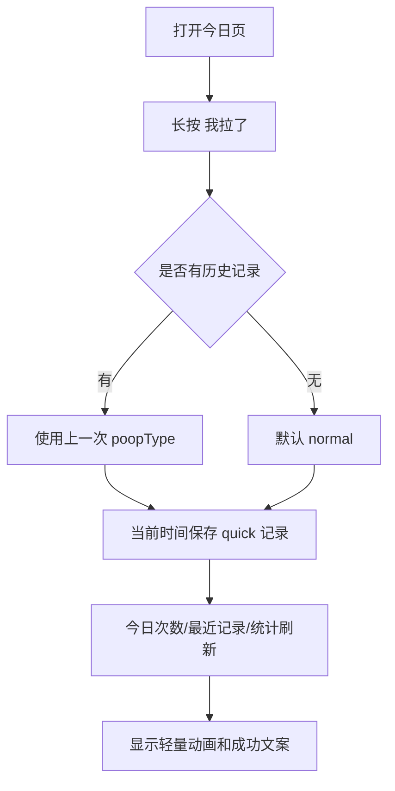
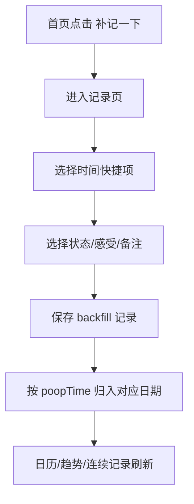
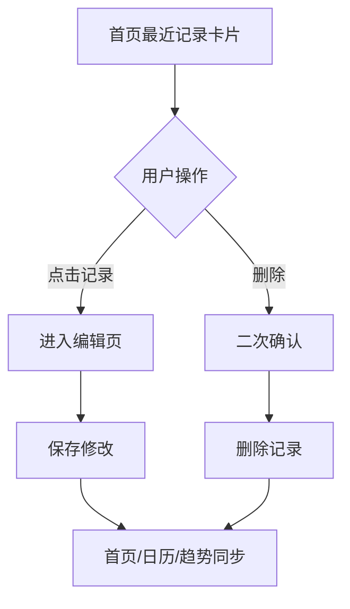
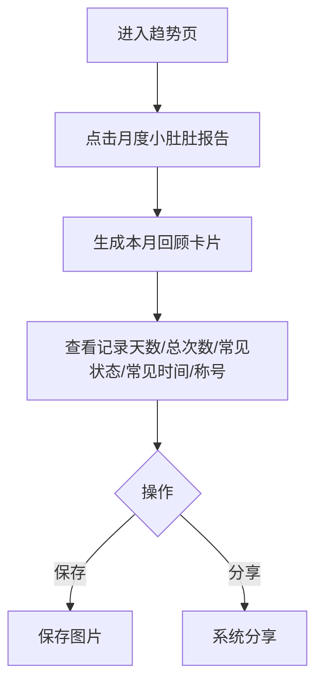

# Lafo V1.1 产品设计规格

日期：2026-05-10  
产品：Lafo  
版本：V1.1  
定位：iOS 本地优先、轻量、可爱、不医疗化的排便记录 App 增强版。

## Objective

Lafo V1.1 的目标是让用户更快记录、更容易补记、更愿意持续打开，同时保持私密、可爱、不医疗化。

核心结果：

- 首页支持一键快速记录，降低记录成本。
- 补记路径更自然，用户忘记记录时也能轻松补上。
- 最近记录可直接编辑/删除，减少查找成本。
- 小宠物成长体系增强留存，但不做断签惩罚。
- 月度回顾提供轻量分享价值，不暴露敏感内容。
- 通知支持隐私模式，减少尴尬和隐私顾虑。

## Product / PRD

### Background

MVP 已完成本地记录、首页、记录页、日历、趋势、伙伴、设置、提醒、CSV 导出和隐私/免责声明。用户下一步最需要的不是更复杂的健康分析，而是更低成本的记录、更顺手的补记、更有情绪价值的回看和更安全的通知表达。

### Target Users

- 已经愿意用 Lafo 做日常记录的用户。
- 经常忘记当场记录、需要晚些时候补记的人。
- 重视隐私，不希望通知或分享暴露敏感词的人。
- 喜欢可爱成长反馈，但不喜欢被催促、惩罚或健康打分的人。

### User Problem

- 打开 App 后还要进入表单，偶尔会嫌麻烦。
- 忘记记录后，手动改时间不够顺手。
- 想改最近一条记录时，进入日历查找成本高。
- 伙伴页目前陪伴感有了，但成长目标还不够清晰。
- 月末有回顾和分享需求，但不能泄露备注和具体敏感细节。
- 通知如果出现敏感词，可能在锁屏或旁人面前尴尬。

### Scope

V1.1 must-have:

- 首页「我拉了 💩」按钮支持长按快速记录。
- 首页增加「补记一下」入口。
- 记录页增加时间快捷项：刚刚、今天早上、今天中午、今天晚上、昨天晚上、自定义时间。
- 首页最近记录卡片展示最近 1-3 条记录，支持编辑和删除。
- 小宠物成长体系：轻松能量、连续解锁表情/装饰、无断签惩罚。
- 月度回顾卡片：记录天数、总次数、最常见状态、最常记录时间、本月称号、保存/分享。
- 设置页新增通知显示模式：可爱模式、隐私模式、极简模式。
- 通知可全部关闭。

V1.1 non-goals:

- 登录注册、账号体系、云同步。
- 社区、好友、排行榜。
- AI 问诊、医生咨询、疾病判断。
- 广告、第三方追踪。
- 复杂健康评分或医学报告。

### Priority

P0:

- 长按快速记录。
- 补记快捷时间。
- 最近记录编辑/删除。
- 通知隐私模式。

P1:

- 小宠物轻松能量和解锁规则。
- 月度回顾卡片展示。

P2:

- 月度回顾保存为图片。
- 月度回顾分享入口。
- 小装饰视觉细节增强。

### Metrics

- 首页长按快速记录使用率。
- 记录完成耗时中位数。
- 补记入口点击率。
- 最近记录编辑/删除使用率。
- 连续 3 天、7 天达成率。
- 伙伴页访问率。
- 月度回顾查看率、分享率、保存率。
- 通知隐私模式开启率。
- 用户反馈“通知尴尬”“太医疗化”“太催促”的数量。

## 页面改动说明

### 今日 Home

新增：

- 「我拉了 💩」按钮支持长按。
- 长按后不进入记录页，直接保存：
  - `poopTime = 当前时间`
  - `poopType = 上一次记录的 poopType`
  - 如果没有历史记录，默认 `poopType = normal`
  - `mood = nil`
  - `painLevel = nil`
  - `note = ""`
- 成功反馈：轻量动画 + 「已快速记录一次轻松时刻 ✨」。
- 增加「补记一下」入口，进入记录页并优先展示时间快捷项。
- 最近记录卡片展示最近 1-3 条：
  - 时间
  - 状态
  - 感受
  - 点击进入编辑
  - 支持删除

调整：

- 今日次数、连续记录、小宠物反馈、最近记录、日历和趋势都以 `poopTime` 为准。
- 首页不要因为用户没记录而使用焦虑型提醒。

### 记录 Record

新增时间快捷项：

- 刚刚：当前时间。
- 今天早上：今天 08:00。
- 今天中午：今天 12:30。
- 今天晚上：今天 20:00。
- 昨天晚上：昨天 20:00。
- 自定义时间：展开日期和时间选择器。

补记模式：

- 从「补记一下」进入时，页面标题为「补记一下」。
- 默认选中「刚刚」，用户可快速切换。
- 保存后记录进入 `poopTime` 对应日期。

编辑模式：

- 点击首页最近记录或日历记录进入。
- 编辑后更新 `updatedAt`。
- 所有统计和日历立即同步。

### 日历 Calendar

调整：

- 日期归属严格以 `poopTime` 计算。
- 补记昨天晚上的记录后，应出现在昨天日期。
- 编辑记录改变 `poopTime` 后，记录移动到新日期。

### 趋势 Stats

调整：

- 本周、本月、连续记录、常见状态、常见时间段全部以 `poopTime` 为准。
- 月度回顾入口可放在趋势页顶部或月度统计卡片中。

新增：

- 「查看本月小肚肚报告」入口。

### 伙伴 Buddy

新增：

- 轻松能量展示。
- 当前等级或成长进度。
- 连续 3 天解锁新表情。
- 连续 7 天解锁小装饰。
- 多天未记录文案：
  - 「没关系，Lafo 一直都在，想起来再记就好 🌱」

规则：

- 不做断签惩罚。
- 未记录不会扣能量。
- 不使用“失败”“中断”“落后”等压力词。

### 我的 Settings

新增通知显示模式：

- 可爱模式：允许轻松可爱的 Lafo 风格，但不低俗。
- 隐私模式：不出现「拉屎」「便便」「肠道」等敏感词。
- 极简模式：只显示非常短的中性提醒。

所有模式都必须支持关闭提醒。

## 数据模型变更

### PoopRecord

MVP 字段继续保留：

```swift
struct PoopRecord: Identifiable, Codable, Equatable {
    var id: UUID
    var createdAt: Date
    var poopTime: Date
    var poopType: PoopType
    var mood: MoodType?
    var painLevel: PainLevel?
    var note: String
    var updatedAt: Date
}
```

V1.1 建议新增：

```swift
var source: RecordSource
var energyAwarded: Int
```

```swift
enum RecordSource: String, Codable, CaseIterable {
    case manual
    case quick
    case backfill
}
```

说明：

- `source` 用于区分快速记录、手动记录、补记，便于后续评估入口价值。
- `energyAwarded` 保存该条记录获得的能量，避免编辑后反复加能量。

### UserSettings

新增：

```swift
var notificationDisplayMode: NotificationDisplayMode
```

```swift
enum NotificationDisplayMode: String, Codable, CaseIterable {
    case cute
    case private
    case minimal
}
```

说明：

- 可与现有 `reminderStyle` 合并，也可保留两个字段：
  - `reminderStyle` 控制语气。
  - `notificationDisplayMode` 控制隐私敏感度。
- 若要避免复杂度，V1.1 推荐用 `notificationDisplayMode` 替代 MVP 的 `ReminderStyle`。

### PetProgress

新增本地对象：

```swift
struct PetProgress: Codable, Equatable {
    var totalEnergy: Int
    var unlockedExpressionIDs: Set<String>
    var unlockedDecorationIDs: Set<String>
    var lastEvaluatedAt: Date
}
```

能量规则：

- 完成一次记录：+5。
- 完整填写状态、感受、备注：+8。
- 备注为空或感受为空：按普通记录 +5。
- 编辑历史记录不重复加能量，除非原记录没有 `energyAwarded`，迁移时补默认值。
- 删除记录不建议扣能量，避免惩罚感；如要保持能量可解释，可在 UI 文案说明“能量代表 Lafo 陪你记录过的时刻”。

### MonthlyReview

统计实时生成，不必持久化：

```swift
struct MonthlyReview {
    let month: Date
    let recordedDays: Int
    let totalPoopCount: Int
    let mostCommonType: PoopType?
    let mostCommonTimeBucket: TimeBucket?
    let title: String
}
```

本月称号示例：

- 记录 0 天：慢慢来观察员。
- 记录 1-5 天：轻松起步员。
- 记录 6-14 天：节奏发现家。
- 记录 15-24 天：肠肠陪伴家。
- 记录 25 天以上：小肚肚月度达人。

## 用户流程

### 长按快速记录



### 补记



### 最近记录编辑/删除



### 月度回顾



## 验收标准

### 一键快速记录

- 首页长按「我拉了 💩」能直接保存记录。
- 有历史记录时使用上一次 `poopType`。
- 无历史记录时默认 `normal`。
- 保存时间为当前时间。
- 成功后显示「已快速记录一次轻松时刻 ✨」。
- 快速记录进入今日次数、最近记录、日历和统计。

### 补记

- 首页能看到「补记一下」入口。
- 记录页有 6 个时间快捷项。
- 选择「昨天晚上」后保存，记录出现在昨天日历。
- 编辑补记记录时间后，日历归属同步移动。
- 统计、连续记录全部以 `poopTime` 计算。

### 最近记录卡片

- 首页展示最近 1-3 条记录。
- 每条显示时间、状态、感受。
- 点击记录可编辑。
- 删除前有确认。
- 编辑或删除后首页、日历、趋势同步更新。

### 小宠物成长

- 普通记录 +5 能量。
- 状态、感受、备注完整填写 +8 能量。
- 连续 3 天解锁新表情。
- 连续 7 天解锁小装饰。
- 多天未记录不扣能量、不降级、不展示惩罚文案。
- 多天未记录时显示「没关系，Lafo 一直都在，想起来再记就好 🌱」。

### 月度回顾

- 可查看本月报告卡片。
- 展示记录天数、总次数、最常见状态、最常记录时间、本月称号。
- 不展示备注、具体记录列表、精确敏感内容。
- 支持保存图片。
- 支持系统分享。
- 文案不出现诊断、疾病判断或治疗建议。

### 通知隐私模式

- 设置页可选择可爱模式、隐私模式、极简模式。
- 隐私模式通知不出现「拉屎」「便便」「肠道」等敏感词。
- 极简模式通知短且中性。
- 关闭提醒后不再发送通知。

## SwiftUI 实现建议

### Store / Domain

建议在 `LafoStore` 增加：

```swift
func quickAddRecord()
func addBackfillRecord(...)
func recentRecords(limit: Int = 3) -> [PoopRecord]
func energyForRecord(_ record: PoopRecord) -> Int
func monthlyReview(for month: Date) -> MonthlyReview
func notificationBody() -> String
```

关键实现：

- `quickAddRecord()` 从 `records.sorted(by: poopTime)` 取最后一次 `poopType`，没有则 `.normal`。
- 所有日期计算统一调用 `poopTime`，不要使用 `createdAt`。
- `energyAwarded` 在创建时写入，编辑时不重复计算。
- 删除记录不扣能量，降低惩罚感。

### HomeView

- 主按钮使用 `simultaneousGesture(LongPressGesture(...))` 或按钮外层手势。
- 短按进入记录页，长按触发 `quickAddRecord()`。
- 成功动画可用：
  - `withAnimation(.spring())`
  - 临时 overlay：`+1 ✨`
  - 1.2 秒后自动消失。
- 最近记录卡片复用现有 `RecordCompactRow`，增加 edit sheet 和 delete confirmation。

### RecordView

- 增加 `RecordEntryMode`：

```swift
enum RecordEntryMode {
    case create
    case backfill
    case edit(PoopRecord)
}
```

- 增加 `TimePreset`：

```swift
enum TimePreset: String, CaseIterable, Identifiable {
    case now
    case thisMorning
    case thisNoon
    case thisEvening
    case yesterdayEvening
    case custom
}
```

- 选择非 custom 时隐藏完整 DatePicker 或放在二级区域。
- 选择 custom 时展示完整日期和时间选择器。

### BuddyView

- 增加能量进度条、解锁列表和小装饰展示。
- 装饰不要遮挡核心信息，优先使用轻量 emoji 或 SF Symbols。
- 文案只强调陪伴，不强调达标压力。

### MonthlyReviewView

- 新建 `MonthlyReviewView` 和 `MonthlyReviewCardView`。
- 卡片尺寸建议固定比例，如 1080:1350 对应竖版分享卡。
- 图片保存可用 `ImageRenderer`：

```swift
let renderer = ImageRenderer(content: MonthlyReviewCardView(review: review))
let image = renderer.uiImage
```

- 分享使用 `ShareLink` 或 `UIActivityViewController`。

### SettingsView

- 将提醒设置拆为：
  - 开关。
  - 时间。
  - 通知显示模式。
- 通知文案按模式生成：
  - 可爱模式：「记一记今天的小肚肚状态吧 🌱」
  - 隐私模式：「Lafo 有一条温柔提醒 🌱」
  - 极简模式：「Lafo 提醒」

## 风险和边界说明

### 产品风险

- 长按快速记录可能误触：需要触觉反馈、撤销入口或最近记录可快速删除。
- 补记可能让统计变化明显：需要统一说明统计按记录时间计算。
- 成长体系可能变成压力：不得使用断签惩罚、扣分、失败、落后等表达。
- 月报分享可能暴露隐私：默认不展示备注、具体时间、精确记录列表。
- 通知仍可能尴尬：隐私模式和极简模式必须足够中性。

### 技术风险

- 现有本地 JSON 数据需要兼容新增字段，必须提供默认值迁移。
- `Set<String>` 若用于 `PetProgress`，Codable 兼容需验证。
- `ImageRenderer` 需要 iOS 16+；当前项目 iOS 18 target 可用。
- 保存图片需要 Photo Library 权限或使用系统分享保存，建议优先系统分享，降低权限申请。
- 长按与短按手势可能冲突，需要实机验证。

### 合规边界

- Lafo 不提供医学诊断、治疗建议或疾病判断。
- 所有趋势和月报只作为生活习惯观察。
- 不使用“便秘”“腹泻”“异常”“风险”等结论性医疗表达。
- 如果出现持续不适，只能提示咨询专业医生。
- 不加入社区、AI 问诊、账号系统、广告或第三方追踪。

## Development Handoff

Technical plan:

- Behavior to implement:
  - Quick record, backfill presets, recent record edit/delete, pet energy, monthly review, notification display mode.
- Files likely affected:
  - `ios/LafoApp/Models.swift`
  - `ios/LafoApp/LafoStore.swift`
  - `ios/LafoApp/HomeView.swift`
  - `ios/LafoApp/RecordView.swift`
  - `ios/LafoApp/CalendarView.swift`
  - `ios/LafoApp/StatsView.swift`
  - `ios/LafoApp/BuddyView.swift`
  - `ios/LafoApp/SettingsView.swift`
  - new `ios/LafoApp/MonthlyReviewView.swift`
- Data/schema impact:
  - Add optional/defaulted fields for record source, awarded energy, pet progress, notification display mode.
- Test plan:
  - Build verification with `xcodebuild`.
  - Manual simulator checks for long press, backfill to yesterday, edit time move date, notification mode copy, monthly card share.
- Chinese comments/logs plan:
  - Add Chinese comments for energy awarding, no-penalty streak, and notification privacy filtering.
  - Keep logs free of note text and sensitive record details.

## Operations Handoff

Launch plan:

- Audience:
  - Existing MVP testers and privacy-sensitive light health record users.
- Channel:
  - TestFlight phased rollout.
- Message:
  - 「Lafo V1.1 记录更快了，也更适合补记；还有不制造压力的小伙伴成长和月度小报告。」
- Success metrics:
  - Quick record usage, backfill usage, 7-day active record days, monthly review views/shares, privacy notification mode adoption.
- Guardrail metrics:
  - Mis-tap complaints, privacy notification complaints, medicalization complaints, growth-pressure complaints.
- Feedback channel:
  - TestFlight feedback + internal form.
- Rollback signal:
  - Quick record误触导致明显数据污染；月报泄露敏感内容；通知隐私模式出现敏感词；新增字段导致老数据读取失败。
- Review cadence:
  - Day 1 quick-record and migration check.
  - Day 3 backfill/calendar/stat consistency check.
  - Day 7 retention and growth-system feedback review.

## Boss Decisions Needed

- 月度回顾「保存图片」是否申请相册权限，还是只走系统分享保存。
- 删除记录是否保持“不扣能量”的产品规则。当前建议不扣。
- V1.1 是否需要在 UI 中展示“快速记录可撤销”，当前建议用最近记录删除承担撤销能力。
